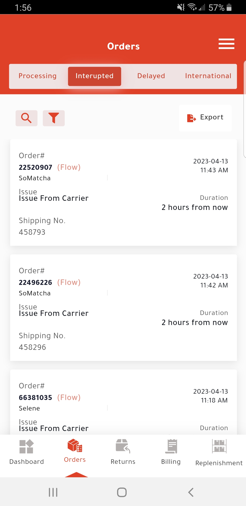
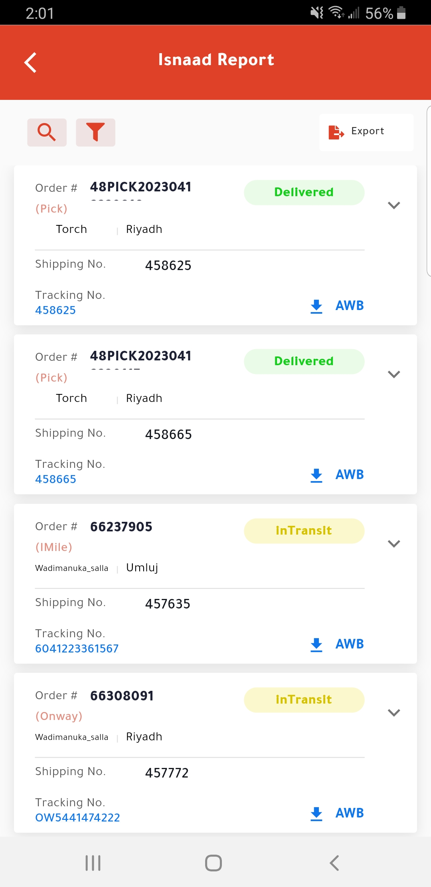

# Isnaad

INTRODUCTION

The Isnaad mobile app project is a comprehensive logistics management system designed for a 3PL logistic company named “Isnaad Logistics”. The app includes three main modules: ticketing system, warehouse management system, and HR system, all in a single, integrated platform. The ticketing system allows customers to submit requests for logistics services, which are then managed and tracked through the app. The warehouse management system provides real-time visibility into inventory levels, allowing for efficient management and tracking of goods. The HR system streamlines the employee management process, providing access to information such as employee schedules, performance metrics, and payroll. Overall, the Isnaad mobile app project is a powerful tool that enables the 3PL logistic company to manage its operations more effectively, improve customer satisfaction, and drive growth.

FEATURES OF ISNAAD

Warehouse Management System

1. Customer Management
2. View Analytics
3. Order Management / Fulfilment Management
4. Waste Management
5. Replenshment Management
6. Courier Management

HR Management

1. Group Chat / Individual Chat
2. Employees Management
3. Payroll Management

Ticketing System

1. Ticket Creation
2. Ticket Complete Process Management
3. Ticket Assignment
4. Tickets History

SYSTEM SCREENSHOTS

                

INSTALLATION LINK

PLAYSTORE LINK: https://play.google.com/store/apps/details?id=com.isnaad

APP STORE LINK: https://apps.apple.com/us/app/isnaad/id1638320059
